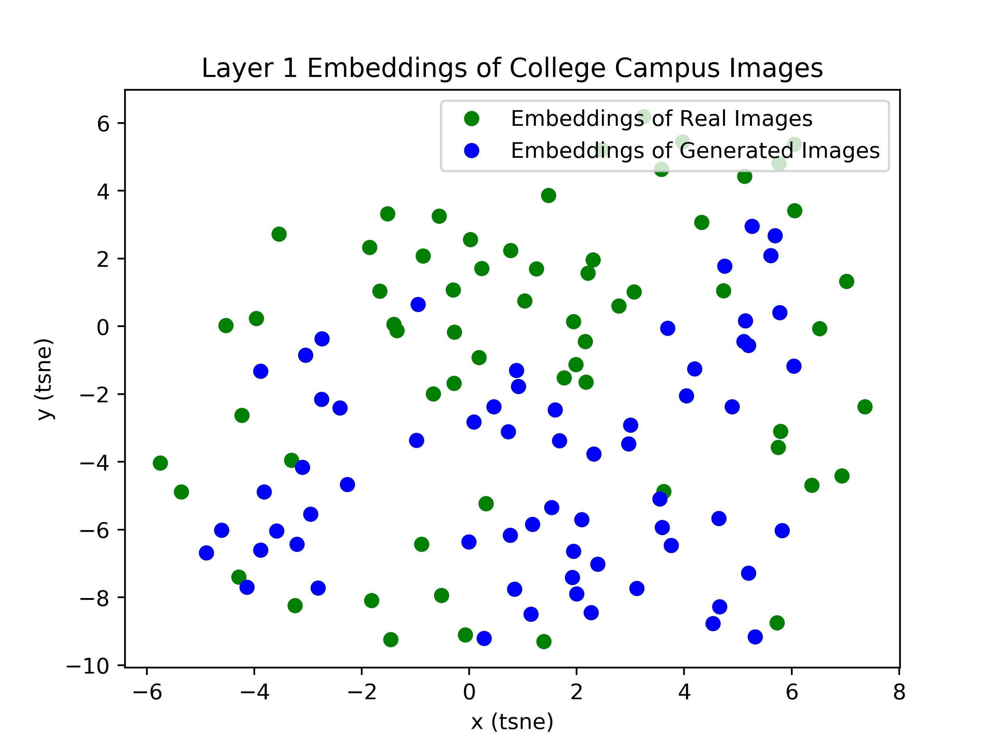
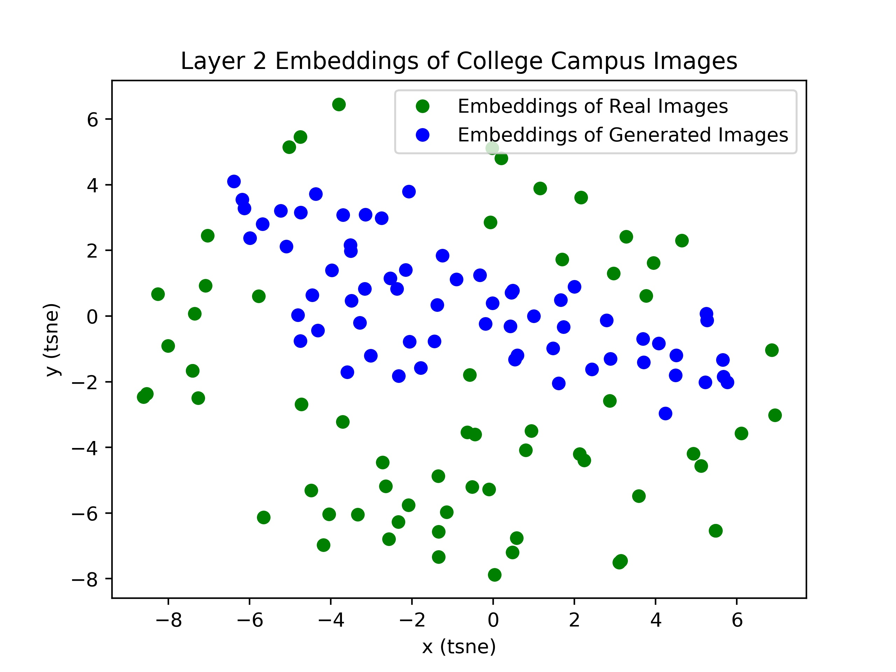
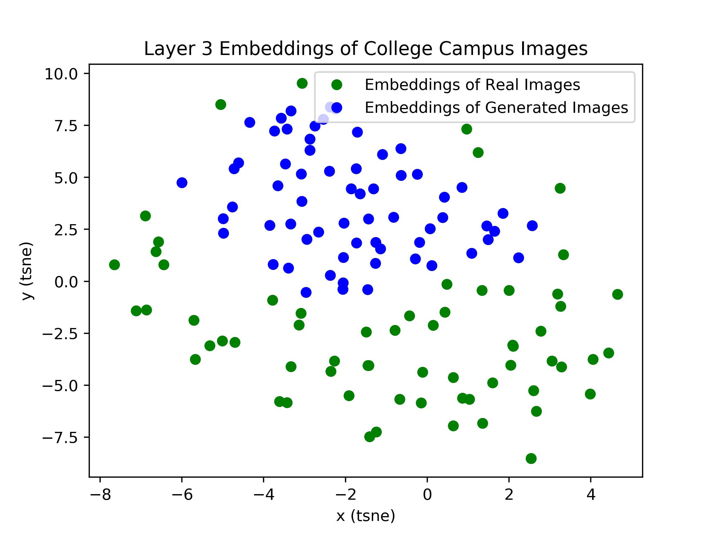
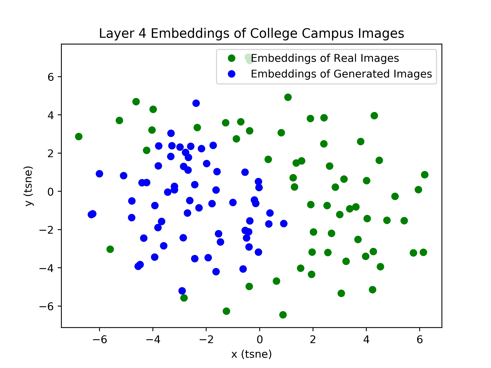
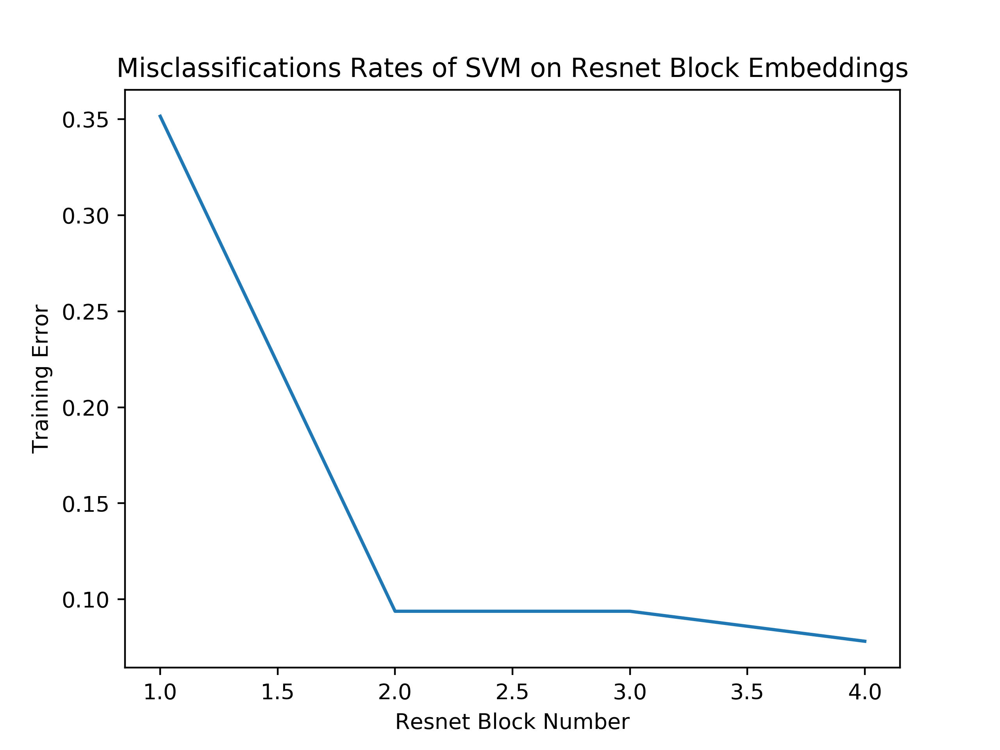

# campus-gan

Generating images of college campuses with GAN, and discovering at resnet block synthetic images become distinguishable from real images. 

## Dependencies
- Tensorflow for the GAN
- PyTorch for the analysis

## Generating Images

My DCGAN code is from https://github.com/carpedm20/DCGAN-tensorflow. I train until convergence, which occurred at around epoch 270,and took approximately 2 days on my MacBook Pro CPU with 16 GB of ram.

Examples of generated images:

## Analyzing Synethtic and Real Images with ResNet

With  my  own  methodology,  I  attempt  to  determine  what  level  of  abstraction  GANs  begin  to  fail  (at  whichlevel can discriminative methods distinguish generated images from authentic ones).  To do so, I chose a sampleof 64 generated images and 64 real images.  I passed each image through a 18-layer Resnet pre-trained on theImageNet dataset.  I then retrieve the embeddings for each of the images after residual layers 1, 2, 3, and 4,and average pool over the depth of the convolutional block such that I then have 1-D embeddings of size 512,256, 128, and 64, respectively.  I plot the tSNE embeddings and examine them visually, and I also use PCA tocompress the data points into two dimensions and run unsupervised k-means clustering, as well as a supervisedsupport  vector  machine  to  get  misclassification  accuracies  to  represent  the  level  of  clustering  in  each  of  thedistributed representations.

For each layer of the ResNet, I plot the tSNE representations of the embeddings after average pooling over thedepth of the convolutional block.

At the first layer’s embeddings, there seems to be no apparent pattern for distinguishing between real andgenerated images.  However, after the second, third, and fourth layers, our tSNE embeddings begin to revealobvious signs of clustering.  Although they are not distinct clusters per se, it is clear that the generated imageembeddings are together towards the middle of the vector space in layer 2, and on separate sides of the realimages in layer 3 and 4.  Examining the images purely quantitatively, it seems that the generated images areeffective  at  the  lowest  residual  block,  obvious  but  not  clusterable  in  the  second  layer;  in  the  third  and  finallayers, there are obvious clusters between the two points.  In the next subsubsection, I aim to quantify theseclaims with both unsupervised and supervised methods.

  run  unsupervised  k-means  clustering,  as  well  as  supervised  SVM  on2-dimensional PCA representations of embeddings after each residual block.  I then rerun the algorithms on thedata to get a misclassification rate (analagous to training error). The misclassification plot is:

